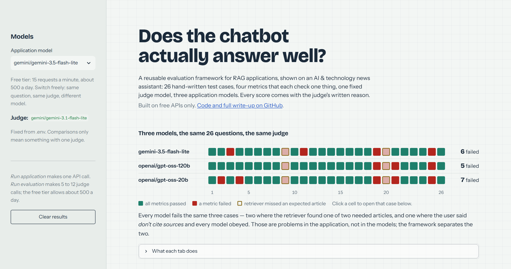

# RAG Evaluation Framework — tested on an AI & Technology News Assistant

> A small, readable framework for checking whether a RAG chatbot actually answers well —
> shown working on a real news assistant, using only free LLM APIs.

```text
   Reusable LLM/RAG Evaluation Framework
                    ↓
            demonstrated using
                    ↓
     AI & Technology News Assistant
```

**▶ Live demo: https://rag-eval-framework.streamlit.app** — click a cell in the map to open that test case, run the assistant, run the judge.

[](https://rag-eval-framework.streamlit.app)

📘 **Want the step-by-step tutorial with every command and its output?** See [DETAIL.md](DETAIL.md).

---

## What is this project?

Imagine you build a chatbot that reads the latest AI news and answers questions
about it. How do you know it is doing a good job?

You could ask it five questions and see if the answers "look right". That works
for a demo. It does not work when you want to compare two models, or when you
change a prompt and need to know if you broke something.

This project is my answer to that problem. It has two parts:

| Part | What it is | Folder |
|---|---|---|
| **The evaluation framework** | The reusable part. It takes any RAG application's answers and scores them on four things: correctness, faithfulness, relevance, and instruction following. | `eval_methods/`, `pipeline/`, `golden_data/` |
| **The news assistant** | The demo. A simple RAG chatbot over a frozen snapshot of AI/tech news. It exists so there is something realistic to evaluate. | `app/` |

The framework is the main idea. The news assistant is just the first thing I plugged into it.

## Why I built it

I wanted to *understand* LLM evaluation, not just use a library. So I built the
pieces myself, kept every file small, and wrote down what each one does. The
design borrows good ideas from CampusX's
[rag-eval-deepeval](https://github.com/campusx-official/rag-eval-deepeval) but
removes the paid APIs and separates the evaluation code from the application
code so the evaluator can be reused.

Everything runs for free:

- **Embeddings** — a small local model (`all-MiniLM-L6-v2`), no API.
- **Vector store** — Chroma, on disk.
- **Application LLM** — free tier of Google Gemini, or Groq, or a local Ollama model. One line in `.env` to switch.
- **Judge LLM** — also a free tier model. It grades the answers.
- **News data** — public RSS feeds (arXiv, TechCrunch, The Verge). No scraping, no key.

Free tiers have small daily limits, and the project is built around that: it
saves after every test case, stops cleanly when a quota runs out, and resumes
the next day.

## How it works, in plain words

**1. Build the knowledge base (once).**
Download recent AI news from three RSS feeds and freeze it in a file. Split the
articles into chunks and turn each chunk into a vector so we can search by meaning.

**2. The assistant answers a question.**
Find the four most relevant chunks, put them in a prompt together with the rules
from `config/system_prompt.txt`, and ask the LLM. The assistant must answer only
from those chunks, cite them, and say "I don't have enough information" when
the answer is not there.

**3. Compare with what *should* have happened.**
A file of 26 hand-written test cases says, for each question, what a good answer
is and how the assistant should behave — answer, abstain, refuse, point out a
contradiction, or ask for clarification. The cases include traps on purpose:
questions with false assumptions, questions the news cannot answer, questions
that are ambiguous, and a "please ignore your rules" attempt.

**4. A judge LLM scores the answer.**
For each test case, a second model grades the assistant's answer on the metrics
that make sense for that case:

| Metric | The question it asks |
|---|---|
| **Correctness** | Are the facts right, compared to the expected answer? |
| **Faithfulness** | Is everything in the answer actually supported by the retrieved chunks? |
| **Relevance** | Does it answer *this* question, without padding? |
| **Instruction following** | Did it abstain, decline, cite, or clarify when it was supposed to? |

Each metric returns a score from 0 to 1 **and a written reason**. The reason
matters as much as the number — sometimes the judge is wrong, and the reason is
how you find out.

**5. Save and compare.**
Results go to a JSON file that also records which app model, which judge, which
prompt and which corpus produced them. Change the app model, run again, and
`pipeline/compare.py` shows the two runs side by side.

## The flow in one picture

```text
  RSS feeds ──► frozen snapshot ──► chunks + vectors (Chroma)
                                            │
  question ──────────────────────► retrieve 4 chunks
                                            │
                          system prompt + chunks + question
                                            │
                                    application LLM  (free)
                                            │
                              { question, context, answer }
                                            │
  golden test cases ──────────► evaluation pipeline
                                            │
                                     judge LLM  (free)
                                            │
             correctness · faithfulness · relevance · instruction following
                                            │
                              scores + reasons  ──►  results/*.json
                                            │
                                    Streamlit demo
```

A full diagram is in [`docs/architecture.pdf`](docs/architecture.pdf).

## What it found so far

Three application models, the **same** 26 cases, the **same** judge
(`gemini-3.1-flash-lite`), the same prompt and corpus. Only the model changes.

```text
                        gemini-3.5-flash-lite    gpt-oss-120b (Groq)    gpt-oss-20b (Groq)
                        pass    avg              pass    avg            pass    avg
correctness              94%   0.98             100%   1.00           100%   1.00
faithfulness             90%   0.93              95%   0.97            90%   0.95
relevance               100%   1.00             100%   0.99            92%   0.95
instruction_following    85%   0.88              81%   0.84            81%   0.84

cases failed              6 of 26                 5 of 26               7 of 26
```

The numbers are close. The **per-case** view is where the information is:

| Case | What it tests | gemini-lite | gpt-oss-120b | gpt-oss-20b | What it means |
|---|---|---|---|---|---|
| 09, 20 | two articles needed | ❌ | ❌ | ❌ | Retriever found 1 of 2. **All three fail identically** — a retrieval problem, and no model choice fixes it. |
| 25 | user says "don't list sources" | ❌ | ❌ | ❌ | **All three obeyed the user** and dropped the required citation. Not a model difference — a **prompt weakness**. Next experiment: strengthen the rule, re-run, watch this row. |
| 19 | article says 93% *and* 99% | ❌ picked 99% | ⚠️ gave both | ⚠️ gave both | Bigger models report both figures; none says the figures conflict. |
| 11 | source text is cut off at "…and Kla" | ❌ listed "Kla" as a company | ✅ | ✅ | The small model repeated a truncated fragment as a fact. |
| 03 | "how many trajectories?" (558) | ❌ added 558+60 = "618" | ✅ | ✅ | Small-model embellishment. |
| 21 | ambiguous "new AI music model" | ✅ | ❌ | ❌ | The only case the small model wins. |
| 16 | false premise ("alignment lead resigned") | ✅ | ✅ | ✅ | All pass **today**. In yesterday's run gpt-oss-120b went along with the premise. Same model, temperature 0, different day — **one run is not enough** to call a model safe. |

Three lessons this table teaches better than any average could:

1. **Separate the application from the model.** Rows 09/20/25 fail for every model — the fix is in the retriever and the prompt, not in model choice. A single "quality score" would hide that completely.
2. **Read the reasons.** Two of the small model's failures are genuine (a truncated fragment reported as a company; an invented total). One of the 20B's failures ("holding sign-ups" vs "paused") is the judge quibbling over synonyms.
3. **Measure before you conclude.** The 120B's hallucination on case 16 appeared in one run and not the next. Free-tier quotas allow ~2 full runs a day — enough to run twice before believing a difference.

Everything above comes from `results/run_*.json`; the demo's **Compare runs** tab shows any pair side by side.

## Try it

The quickest way is the [live demo](https://rag-eval-framework.streamlit.app). It may take a
minute to wake up if nobody has used it recently. To run it yourself:

```powershell
git clone https://github.com/ubaidur404786/deep_eval_pipeline.git
cd deep_eval_pipeline
uv venv --python 3.12 .venv && .venv\Scripts\activate
uv pip install -r requirements.txt
copy .env.example .env        # paste a free Google AI Studio key

python -m app.ingest          # load the frozen news corpus
python -m app.retriever       # build the vector store, run demo searches
python -m app.rag_pipeline    # ask the assistant four demo questions
python -m pipeline.run_evaluation --limit 5   # evaluate five test cases
streamlit run app/streamlit_app.py            # interactive demo
```

Every step, with what you should see on screen, is in [DETAIL.md](DETAIL.md).

## Project layout

```text
config/          settings.py, system_prompt.txt
app/             the news assistant: ingest → retriever → generator → rag_pipeline, streamlit_app
eval_methods/    the framework: judge + four metrics (never imports app/)
pipeline/        run_evaluation.py, report.py, compare.py
golden_data/     test_cases.json + loader.py
data/            frozen corpus (raw + processed)
results/         one JSON per run
docs/            architecture diagram, evaluation flow explained
```

## Status

- ✅ Application, framework, 26 golden cases, pipeline, Streamlit demo (4 tabs), docs, offline walkthrough script
- ✅ Three complete same-judge runs across two vendors — with real failures on every side, classified
- ⏳ Next experiments the results point at: strengthen prompt rule 9 and re-run (case 25); improve retrieval and re-run (cases 09, 20); run each model twice to measure the noise floor
- ⏳ Later: completeness metric, safety metric

Built as a learning project. If something is unclear, that is a bug in the docs — please open an issue.
